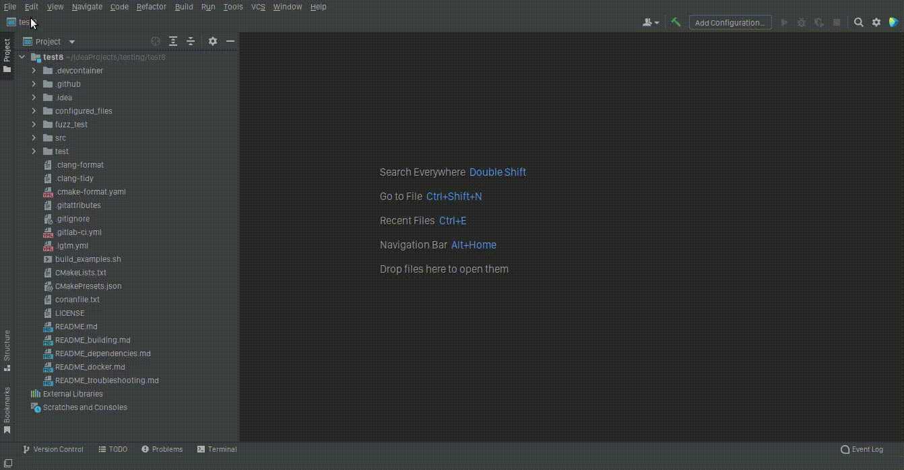

# Modern_Cpp_New_Project-plugin
Tired of manually copying around a standard modern Cpp project template every time you create a new project? 
Well look no more, for this is a solution to this problem. This plugin automates this mundane task by caching your template. 
This way  you can even work offline for some time. It mainly provides a 'Modern Cpp New Project' option, and allows you to selected a template of your choice.
It goes on to configure your project in your new location. No muss, no fuss.
## Usage

## Support

**Messed up for now** : _supports intellij 2022.3.3_  . Get it :laughing: